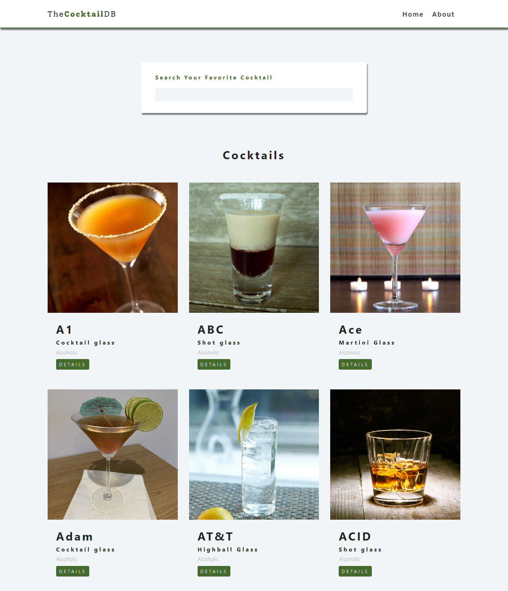
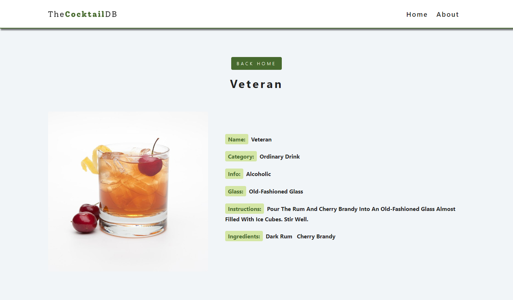

## Installation

Use the package manager npm to install project

```bash
npm install
```

after installiation run this command to run the project

```bash
npm run dev
```

## About Project

simple react project with context API and react router.

from react udemy course.
[link](https://www.udemy.com/course/react-tutorial-and-projects-course/)

## Overview





## Preview Site

[Link](https://unrivaled-mermaid-74de37.netlify.app/)
